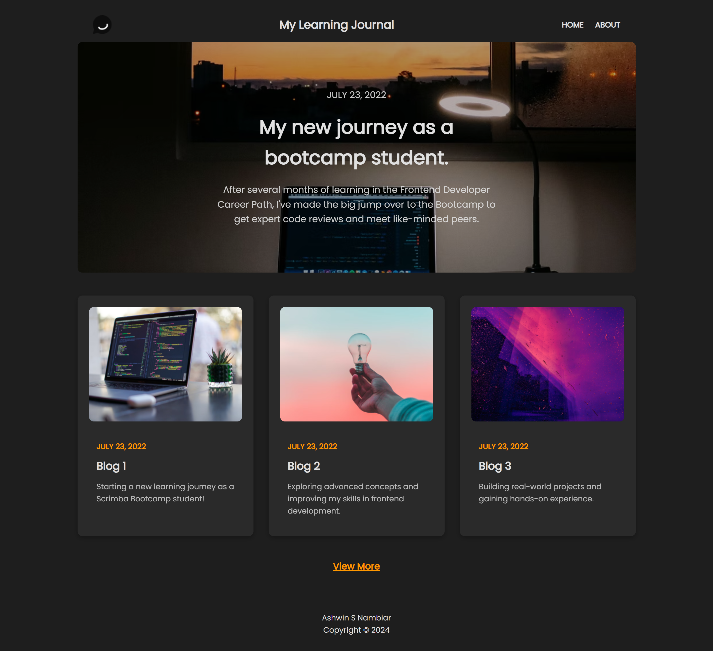
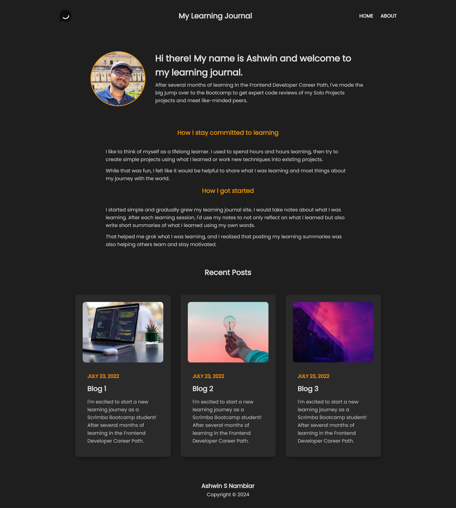
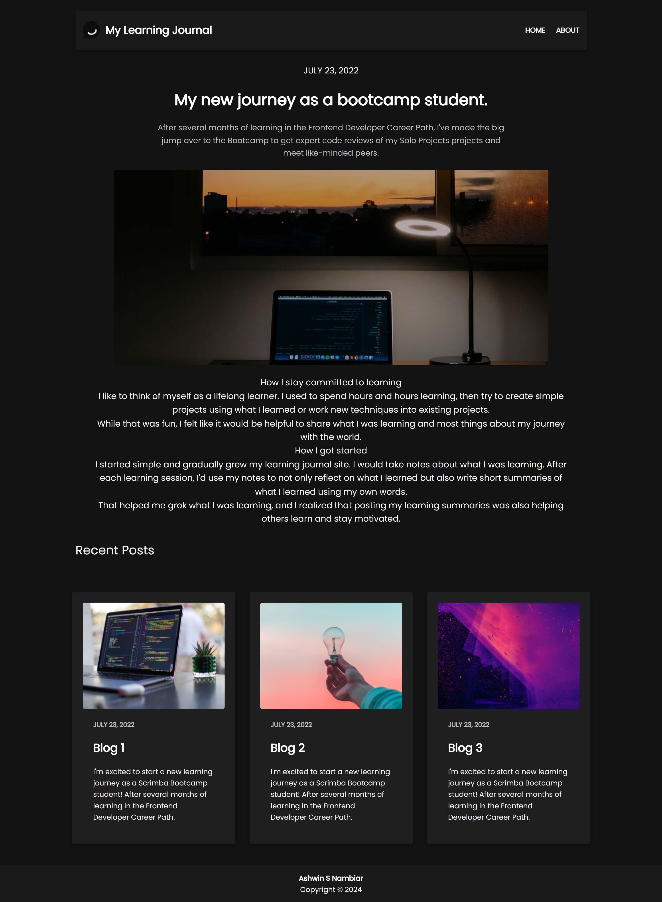

# Learning Journal 📘

<div align="center">


</div>

## Live
<div align="center">

[](https://chic-mochi-ffaa48.netlify.app/)

</div>

## Overview

**Learning Journal is a personal project crafted to deepen my understanding of responsive design. This website showcases various CSS techniques that adapt layouts seamlessly across different devices and screen sizes, making it an ideal resource for exploring modern UI/UX practices.**

## ⚒️ Built With

- **HTML5:** For semantic structure and accessibility.
- **CSS3:** To implement responsive layouts and visually engaging designs.
- **JavaScript:** To add interactivity and enhance the overall user experience.

## 📷 Screenshots

<div align="center">

  
  <br>

  
  <br>

  
  <br>
</div>

## Getting Started

To run the project locally:

1. **Clone the repository:**
   ```bash
   git clone https://github.com/your-username/learning-journal.git
   cd learning-journal

2. **Open the project:**
      - **Open the index.html file in your preferred browser.**


## 🤝 Contributing
Contributions are welcome! If you have suggestions or improvements, please:

1. **Fork the repository.**
      - Create a feature branch: 
      ```bash
      git checkout -b feature/your-feature-name
      ```

2. **Commit your changes**:
    ```bash
    git commit -m "Add your feature description"
    ```

3. **Push to the branch**:

    ```bash
    git push origin feature/your-feature-name
    ```

4. **Open a pull request**.

## 👤 Author

### Ashwin S Nambiar
- Portfolio: [ashwin.co.in](https://ashwin.co.in)
- GitHub: [@Ashwin-S-Nambiar](https://github.com/Ashwin-S-Nambiar)

---

<div align="center">
Made with ❤️ by Ashwin S Nambiar
</div>
